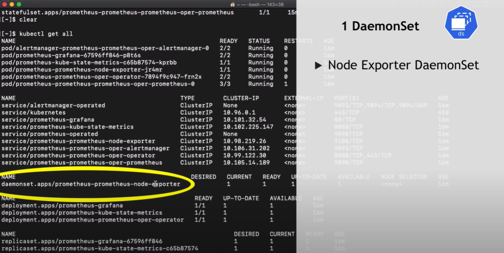
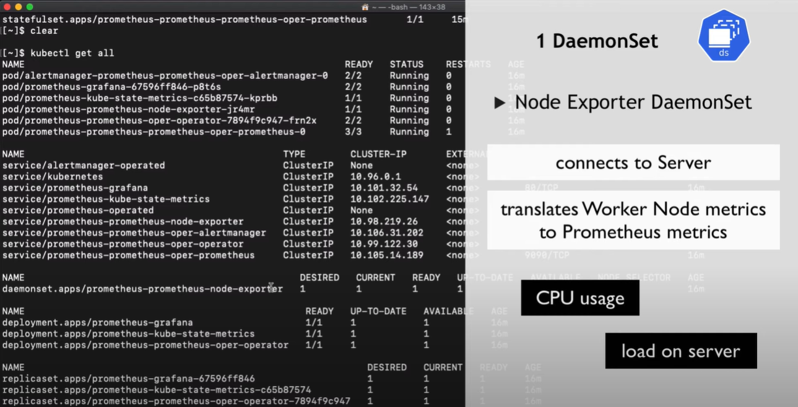
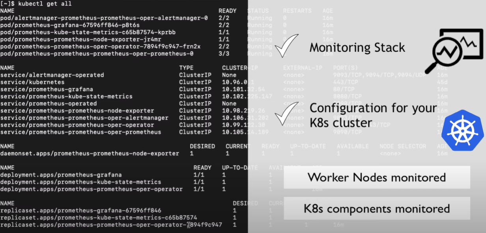
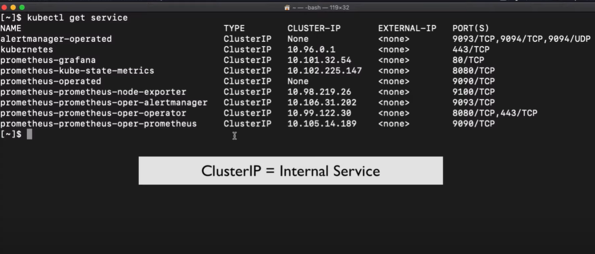
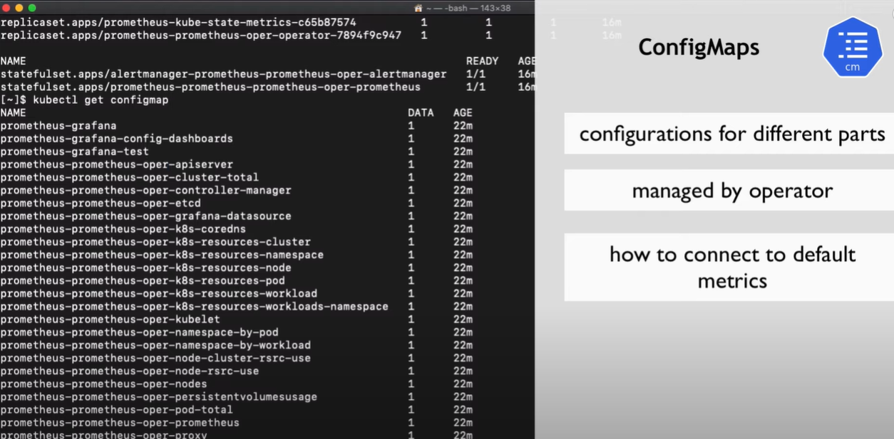
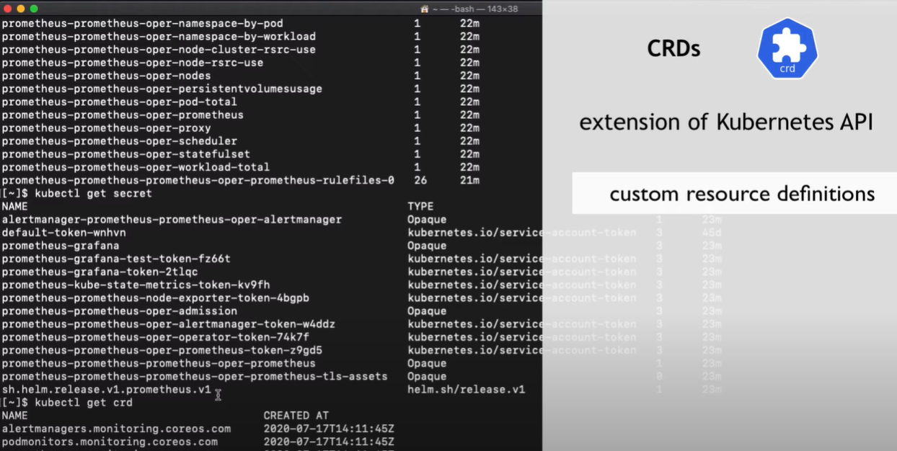
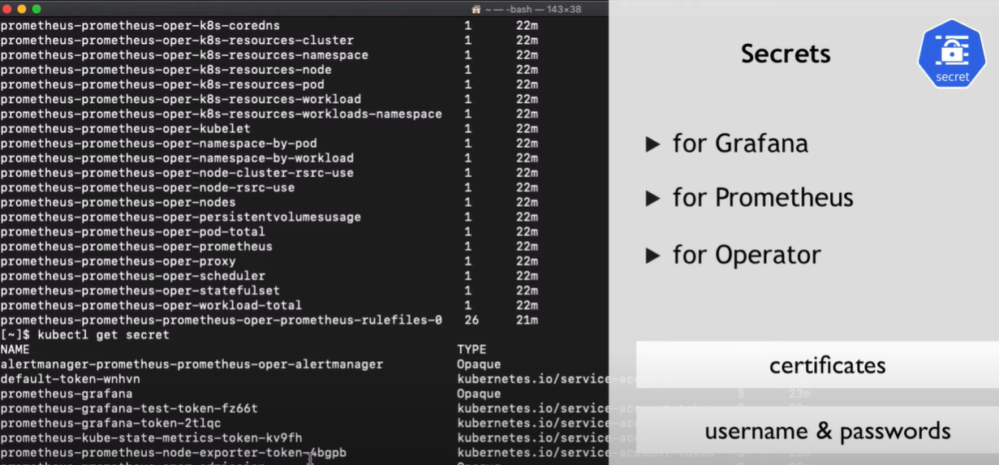
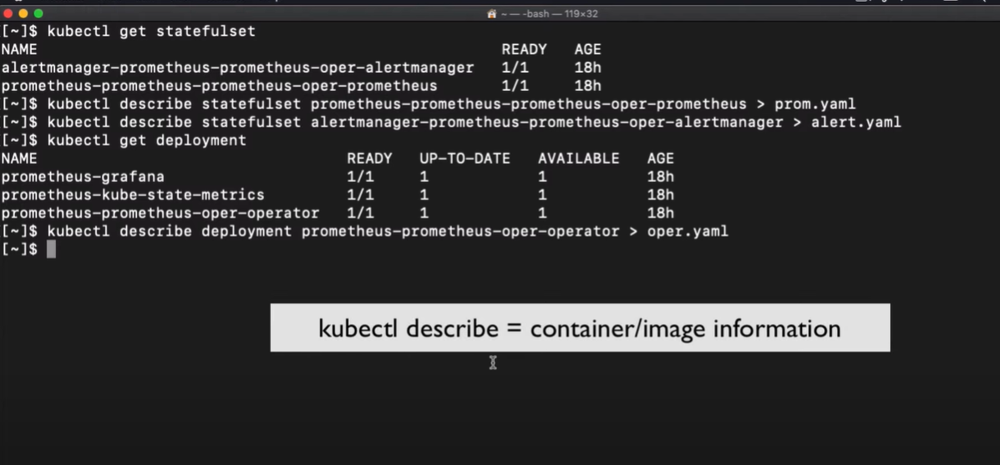

# Start Minikube Cluster
```
minikube start
```
# Install Prometheus-operator
## add repos
```
helm repo add prometheus-community https://prometheus-community.github.io/helm-charts
helm repo add stable https://kubernetes-charts.storage.googleapis.com/
helm repo update
```
# Install chart
```
helm install prometheus prometheus-community/kube-prometheus-stack
```
# install chart with fixed version
```
helm install prometheus prometheus-community/kube-prometheus-stack --version "9.4.1"
```
Link to chart
[https://github.com/prometheus-community/helm-charts/tree/main/charts/kube-prometheus-stack]

# Afer Installing prometheus
```
kubectl get pod
kubectl get all
```

### DaemonSet: Node Exporter DaemonSet
DaemonSet will run on every single worker node


### Node Exporter DaemonSet
Translate Worder Node metrics to prometheus metrics like CPU, RAM, Load


# We have setup a monitoring stack
```
kubectl get statefulsets
```


# Access Grafana now
```
kubectl get service
```
These are Cluser Ip, they are not open for reqest, they are all closed

## Get deployment
```
kubectl get deployment
```
## Get pod ports
```

kubectl logs promethus-grafana-67596ff846 -c grafana
kubectl port-forward svc/prometheus-grafana 3000:80
username: admin
password: prom-operator
```

# Screenshots






